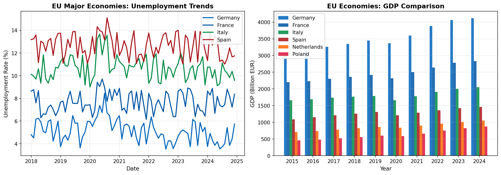

# EU Economic Indicators - dbt Project

A production-grade dbt project demonstrating modern data engineering practices using Eurostat economic data.

[](https://www.getdbt.com/)
[](https://duckdb.org/)
[](LICENSE)

## Overview

This project extracts economic indicators from the [Eurostat REST API](https://ec.europa.eu/eurostat/web/main/data/web-services) and transforms them into analytics-ready datasets using dbt (data build tool) with DuckDB as the warehouse.

### 🌟 Advanced Features Demonstrated

| Feature | Description | dbt Version |
|---------|-------------|-------------|
| **Unit Tests** | Test business logic in isolation with mock data | 1.8+ |
| **Model Contracts** | Enforce column types and constraints at compile time | 1.5+ |
| **Semantic Layer** | MetricFlow metric definitions for consistent BI | 1.6+ |
| **Python Models** | pandas/numpy for ML and advanced analytics | 1.3+ |
| **Incremental Models** | Efficient processing of new data only | 1.0+ |
| **Snapshots** | SCD Type 2 for tracking data revisions | 1.0+ |

### Data Sources

| Dataset | Description | Grain | Update Frequency |
|---------|-------------|-------|------------------|
| `nama_10_gdp` | GDP and main components | Annual | Quarterly |
| `une_rt_m` | Unemployment rate | Monthly | Monthly |
| `prc_hicp_mmor` | HICP inflation | Monthly | Monthly |
| `demo_pjan` | Population | Annual | Annual |

### Countries Covered

Core EU economies: Germany (DE), France (FR), Italy (IT), Spain (ES), Netherlands (NL), Belgium (BE), Austria (AT), Poland (PL), plus EU27 aggregate.

## Data Visualization



*Sample visualization showing unemployment trends and GDP comparison across major EU economies. Generated from the dbt marts layer data.*

## Architecture

```
┌─────────────────┐     ┌─────────────────┐     ┌─────────────────┐
│   Eurostat API  │────▶│     DuckDB      │────▶│   dbt Models    │
│   (REST JSON)   │     │   (raw tables)  │     │                 │
└─────────────────┘     └─────────────────┘     └─────────────────┘
                                                        │
                        ┌───────────────────────────────┼───────────────────────────────┐
                        │                               │                               │
                        ▼                               ▼                               ▼
                ┌───────────────┐              ┌───────────────┐              ┌───────────────┐
                │    Staging    │              │ Intermediate  │              │     Marts     │
                │               │              │               │              │               │
                │ • stg_gdp     │─────────────▶│ • int_annual  │─────────────▶│ • dim_country │
                │ • stg_unemp   │              │ • int_monthly │              │ • fct_econ    │
                │ • stg_infl    │              │               │              │ • rpt_summary │
                │ • stg_pop     │              │  [Unit Tests] │              │               │
                └───────────────┘              └───────────────┘              │ [Contracts]   │
                                                                              │ [Semantic]    │
                                                                              └───────┬───────┘
                                                                                      │
                                                        ┌─────────────────────────────┼─────────────────────────────┐
                                                        │                             │                             │
                                                        ▼                             ▼                             ▼
                                                ┌───────────────┐            ┌───────────────┐            ┌───────────────┐
                                                │   Python:     │            │   Python:     │            │   Python:     │
                                                │   Anomaly     │            │   Forecasting │            │   Data Quality│
                                                │   Detection   │            │               │            │   Scoring     │
                                                └───────────────┘            └───────────────┘            └───────────────┘
```

## Project Structure

```
eu_economic_indicators/
├── models/
│   ├── staging/                    # 1:1 with source tables
│   │   ├── _sources.yml            # Source definitions + freshness
│   │   ├── _staging__models.yml    # Schema documentation
│   │   └── stg_eurostat__*.sql     # Staging models
│   │
│   ├── intermediate/               # Business logic layer
│   │   ├── _intermediate__models.yml
│   │   ├── _intermediate__unit_tests.yml  # ⭐ UNIT TESTS
│   │   └── int_country_*.sql
│   │
│   └── marts/                      # Consumption layer
│       ├── _marts__models.yml      # ⭐ MODEL CONTRACTS
│       ├── _python_models.yml      # Python model docs
│       ├── dim_country.sql         # Dimension table
│       ├── fct_economic_indicators.sql  # Incremental fact
│       ├── rpt_annual_economic_summary.sql
│       ├── py_anomaly_detection.py      # ⭐ PYTHON MODEL
│       ├── py_unemployment_forecast.py  # ⭐ PYTHON MODEL
│       └── py_data_quality_scores.py    # ⭐ PYTHON MODEL
│
├── seeds/
│   └── country_metadata.csv
│
├── snapshots/
│   └── snap_gdp_history.sql        # SCD Type 2
│
├── macros/
│   ├── calculations.sql
│   └── data_quality.sql
│
├── tests/
│   └── assert_eu_aggregate_consistency.sql
│
├── scripts/
│   └── extract_eurostat.py
│
├── dbt_project.yml
├── profiles.yml
└── README.md
```

## Quick Start

### Prerequisites

- Python 3.9+
- dbt-core 1.8+ (for unit tests)
- dbt-duckdb 1.8+

### Installation

```bash
# Clone the repository
git clone https://github.com/yourusername/eu_economic_indicators.git
cd eu_economic_indicators

# Create virtual environment
python -m venv venv
source venv/bin/activate  # Windows: venv\Scripts\activate

# Install dependencies
pip install -r requirements.txt
```

### Extract Data

```bash
# Full extraction (creates/replaces tables)
python scripts/extract_eurostat.py --full-refresh

# Incremental extraction (appends new data)
python scripts/extract_eurostat.py
```

### Run dbt

```bash
# Seed reference data
dbt seed

# Run all models
dbt run

# Run unit tests (dbt 1.8+)
dbt test --select "test_type:unit"

# Run all tests
dbt test

# Generate documentation
dbt docs generate
dbt docs serve
```

## ⭐ Advanced Features Deep Dive

### 1. Unit Tests (dbt 1.8+)

Unit tests validate business logic in isolation using mock data:

```yaml
# models/intermediate/_intermediate__unit_tests.yml
unit_tests:
  - name: test_gdp_per_capita_calculation
    model: int_country_annual_metrics
    given:
      - input: ref('stg_eurostat__gdp')
        rows:
          - {country_code: 'DE', gdp_million_eur: 4000000, ...}
      - input: ref('stg_eurostat__population')
        rows:
          - {country_code: 'DE', population_count: 84000000, ...}
    expect:
      rows:
        - {country_code: 'DE', gdp_per_capita_eur: 47619.047619}
```

**Tests included:**
- GDP per capita calculation (including division by zero)
- Year-over-year change calculation
- Rolling average calculation
- Data quality flag logic

### 2. Model Contracts

Contracts enforce schema at compile time, preventing breaking changes:

```yaml
# models/marts/_marts__models.yml
models:
  - name: fct_economic_indicators
    config:
      contract:
        enforced: true
    columns:
      - name: indicator_key
        data_type: varchar
        constraints:
          - type: not_null
          - type: unique
      - name: unemployment_rate_pct
        data_type: double
```

### 3. Semantic Layer (MetricFlow)

Consistent metric definitions for all BI tools:

```yaml
# models/marts/_semantic_models.yml
metrics:
  - name: unemployment_rate
    description: Average unemployment rate (seasonally adjusted)
    type: simple
    label: Unemployment Rate (%)
    type_params:
      measure: unemployment_rate

  - name: gdp_per_capita_derived
    description: GDP per capita (calculated)
    type: derived
    type_params:
      expr: (total_gdp * 1000000) / population
      metrics:
        - name: total_gdp
        - name: population
```

**Metrics defined:**
- `total_gdp` - Sum of GDP
- `average_gdp_per_capita` - Average GDP per capita
- `gdp_growth` - YoY GDP growth rate
- `unemployment_rate` - Average unemployment
- `unemployment_trend` - 12-month rolling average
- `monthly_inflation` - MoM inflation rate
- `annual_inflation` - Annual inflation
- `cumulative_gdp_growth` - Cumulative growth

### 4. Python Models

ML and advanced analytics within dbt:

#### Anomaly Detection (`py_anomaly_detection.py`)
```python
# Detects anomalous economic readings using:
# - Z-score method (>3 std from mean)
# - IQR method (robust outlier detection)
# - Rate-of-change analysis (sudden spikes)
```

#### Unemployment Forecasting (`py_unemployment_forecast.py`)
```python
# 6-month ahead forecasts using:
# - Exponential Smoothing
# - Holt's Linear Trend
# - Linear Regression
# - Ensemble (average of methods)
# Includes prediction intervals
```

#### Data Quality Scoring (`py_data_quality_scores.py`)
```python
# Scores each country on:
# - Completeness (% non-null values)
# - Timeliness (recency of data)
# - Validity (values in expected ranges)
# - Consistency (no suspicious patterns)
# Outputs letter grade (A-F)
```

## Example Queries

### Query Semantic Layer Metrics
```bash
# Using MetricFlow CLI
mf query --metrics unemployment_rate,gdp_growth \
         --group-by country_code,metric_time__year \
         --where "country_code = 'DE'"
```

### Anomaly Analysis
```sql
SELECT 
    country_code,
    reference_date,
    unemployment_rate_pct,
    unemployment_z_score,
    anomaly_severity_score
FROM marts.py_anomaly_detection
WHERE is_any_anomaly = true
ORDER BY anomaly_severity_score DESC;
```

### Forecast Comparison
```sql
SELECT 
    country_code,
    forecast_date,
    last_actual_value,
    forecast_ensemble,
    prediction_interval_lower,
    prediction_interval_upper,
    forecast_confidence
FROM marts.py_unemployment_forecast
WHERE country_code = 'DE'
ORDER BY forecast_date;
```

### Data Quality Dashboard
```sql
SELECT 
    country_code,
    quality_grade,
    overall_quality_score,
    primary_issue,
    days_since_latest_data
FROM marts.py_data_quality_scores
ORDER BY overall_quality_score ASC;
```

## Testing Strategy

| Test Type | Location | Command |
|-----------|----------|---------|
| Unit Tests | `*__unit_tests.yml` | `dbt test --select "test_type:unit"` |
| Generic Tests | `*__models.yml` | `dbt test --select "test_type:generic"` |
| Singular Tests | `tests/` | `dbt test --select "test_type:singular"` |
| Source Freshness | `_sources.yml` | `dbt source freshness` |
| Contract Validation | Compile time | `dbt compile` |

## Configuration

### Variables in `dbt_project.yml`

```yaml
vars:
  start_year: 2010
  end_year: 2024
  focus_countries: ['DE', 'FR', 'IT', 'ES', 'NL', 'BE', 'AT', 'PL']
```

## Contributing

1. Create a feature branch
2. Make changes
3. Run `dbt build` (runs + tests)
4. Submit a pull request

## License

MIT License - see [LICENSE](LICENSE) for details.

## Author

**Simon Vegelahn**  
Business Informatics Student | Data Engineer  
[LinkedIn](https://www.linkedin.com/in/simonvegelahn) | [GitHub](https://github.com/SimonVegelahn)

---

*Built with dbt + DuckDB + Eurostat Open Data*

### Skills Demonstrated

- ✅ dbt Core (staging → intermediate → marts)
- ✅ Incremental Models
- ✅ Snapshots (SCD Type 2)
- ✅ **Unit Tests** (dbt 1.8+)
- ✅ **Model Contracts**
- ✅ **Semantic Layer / MetricFlow**
- ✅ **Python Models** (pandas, numpy)
- ✅ Custom Macros
- ✅ Data Quality Testing
- ✅ Source Freshness Monitoring
- ✅ Comprehensive Documentation
